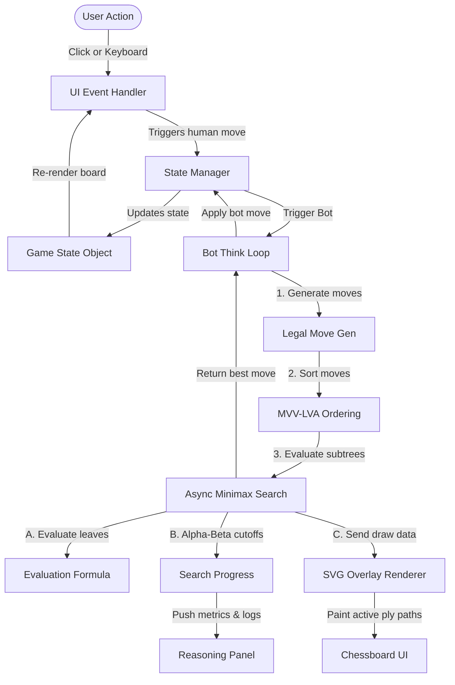
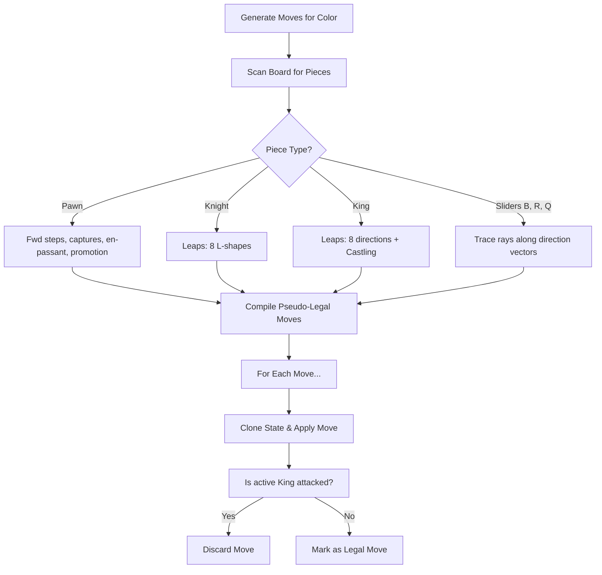
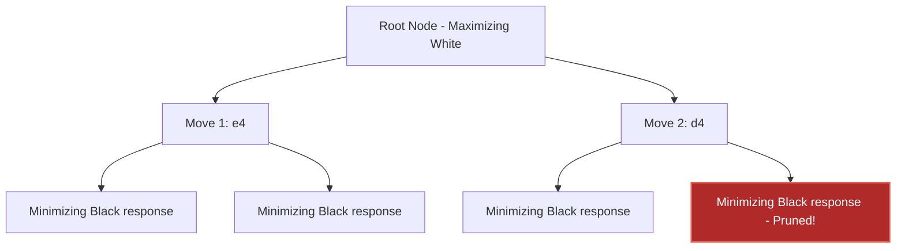

# NeuralChess: Architecture & Implementation Guide

Welcome to the technical guide for **NeuralChess**—a fully client-side chess game and transparent engine built from scratch with zero external dependencies. This document details the system design, data representations, search algorithm, evaluation formula, and real-time visualization overlay that lets users observe the engine's decision-making process.

---

## 1. High-Level Architecture

NeuralChess is structured around three core pillars, keeping the application entirely self-contained:
1. **The Game Core**: Handles board representation, full chess rule validation (including castling, promotion, and en-passant), and move generation.
2. **The Search & Eval Engine**: A Minimax search agent with Alpha-Beta pruning, MVV-LVA move ordering, and a transparent evaluation heuristic.
3. **The User Interface & Visualizer**: Renders the board, orchestrates asynchronous visual steps (arrows and square pulses) representing the search tree, updates detailed metrics, and synthesizes audio effects.

### Data & Control Flow
The diagram below illustrates the relationship between the UI, the state machine, the search engine, and the visual overlay:



---

## 2. Data Models & Game State

The entire board and game state are captured in simple, lightweight JavaScript objects.

### Board Representation
The board is represented as a single-dimensional 64-element array:
* **Index calculation**: `index = rank * 8 + file`
* **Rank (`r`)**: `0` represents the 8th rank (top row, Black side), `7` represents the 1st rank (bottom row, White side).
* **File (`f`)**: `0` represents file `a` (leftmost column), `7` represents file `h` (rightmost column).

For example, `a8` maps to index `0`, `h8` to index `7`, `a1` to index `56`, and `h1` to index `63`.

```
        a   b   c   d   e   f   g   h
      +---+---+---+---+---+---+---+---+
    8 | 0 | 1 | 2 | 3 | 4 | 5 | 6 | 7 |  (Black Back Rank)
      +---+---+---+---+---+---+---+---+
    7 | 8 | 9 |10 |11 |12 |13 |14 |15 |
      +---+---+---+---+---+---+---+---+
      ...
      +---+---+---+---+---+---+---+---+
    2 |48 |49 |50 |51 |52 |53 |54 |55 |
      +---+---+---+---+---+---+---+---+
    1 |56 |57 |58 |59 |60 |61 |62 |63 |  (White Back Rank)
      +---+---+---+---+---+---+---+---+
```

Each non-empty square holds a piece object:
```typescript
interface Piece {
  type: 'P' | 'N' | 'B' | 'R' | 'Q' | 'K';
  color: 'w' | 'b';
}
```

### Game State Struct
The global game state object tracks active play settings and historical turns (enabling multi-step undos):

```typescript
let state = {
  board: (Piece | null)[],   // Length-64 board array
  turn: 'w' | 'b',           // Player to move
  castling: {                // Castling availability
    wK: boolean, wQ: boolean,
    bK: boolean, bQ: boolean
  },
  ep: number | null,         // En-passant target square index
  captured: {                // Captured pieces tracking
    w: string[],             // Pieces captured BY White
    b: string[]              // Pieces captured BY Black
  },
  halfmove: number,          // 50-move rule counter (resets on pawn moves & captures)
  history: HistoryEntry[]    // Undo history: states + move notations
};
```

---

## 3. Chess Engine Logic: Move Generation & Validation

Standard chess requires complex rules. To keep search fast and accurate, move validation is split into **Pseudo-legal generation** and **Check filtering**.

### Move Generation Pipeline
1. **Pseudo-legal moves**: Calculates all standard sliding, leaping, and pawn movements matching their movement vectors, ignoring whether the move leaves the active king in check.
2. **Move validation**: Applies the move to a cloned board, checks if the opponent can attack the king on the next turn, and discards illegal moves.



### Attack Matrix (`isSquareAttacked`)
To quickly evaluate whether a square is attacked (for check detection and castling check-zones), the engine performs **reverse ray-casting**:
* **Knight attacks**: Checks the 8 L-shaped leap offsets from the target square for opponent knights.
* **Pawn attacks**: Checks the two forward diagonal capture offsets for opponent pawns.
* **King attacks**: Checks the immediate surrounding squares for the opponent king.
* **Sliding attacks (B, R, Q)**: Radiates outwards from the target square along diagonal and orthogonal lines. If it hits an opponent bishop/queen (diagonal) or rook/queen (orthogonal) before hitting any other piece, the square is attacked.

---

## 4. Transparent Evaluation Formula

At leaf nodes of the search tree, or when depth is exhausted, the engine runs `evaluate()`. It returns a single integer (in centipawns), where a positive score favors **White** and a negative score favors **Black**.

$$\text{Total Score} = \text{Material} + \text{Position} + \text{Mobility} + \text{King Safety}$$

### 1. Material Evaluation
Pieces are valued in standard centipawns:

| Symbol | Piece Type | Centipawn Value |
| :---:  | :---:      | :---:           |
| **P**  | Pawn       | 100 cp          |
| **N**  | Knight      | 320 cp          |
| **B**  | Bishop     | 330 cp          |
| **R**  | Rook       | 500 cp          |
| **Q**  | Queen      | 900 cp          |
| **K**  | King       | 20,000 cp       |

### 2. Positional Evaluation (Piece-Square Tables)
The engine maintains Piece-Square Tables (PST) mapping 64 squares to positional bonuses. This guides pieces to seek center-control and safety:
* **Pawns** are rewarded for advancing, especially passed pawns.
* **Knights** are penalized on the edge squares ("A knight on the rim is dim").
* **Bishops** prefer open diagonals and active development.
* **Kings** are rewarded for castling to the corners (`g1`/`c1` for white) and heavily penalized for stepping into the center during middle-games.

*Note: For Black pieces, indices are mirrored vertically (`63 - idx`) so White and Black evaluate positions symmetrically.*

### 3. Mobility
Mobility encourages active pieces by comparing the raw number of pseudo-legal moves available to each player:
$$\text{Mobility Score} = (\text{White Legal Moves} - \text{Black Legal Moves}) \times 2$$

### 4. King Safety
A simple check penalty is applied dynamically to prevent stalling and encourage defensive postures:
* **-50** to the score if White is in check.
* **+50** to the score if Black is in check.

---

## 5. Search Algorithm: Minimax with Alpha-Beta Pruning

To find the best move, the bot recursively builds a search tree to the depth selected by the user. 

### Minimax Process
At White's turn, the engine tries to **maximize** the score. At Black's turn, it tries to **minimize** the score. 
* **Alpha ($\alpha$)**: The minimum score the maximizing player is assured of.
* **Beta ($\beta$)**: The maximum score the minimizing player is assured of.
* **Pruning**: If a branch is found that will guarantee a worse result than a previously evaluated branch, that branch is pruned (`beta <= alpha`), avoiding expensive tree traversals.



### Move Ordering (MVV-LVA Heuristic)
Alpha-beta pruning is most effective when the best moves are searched first. NeuralChess implements **MVV-LVA** (Most Valuable Victim - Least Valuable Aggressor) to sort the moves before recursive search:
1. **Captures**: Sorted by the value of the captured piece minus the value of the attacking piece (e.g., $P \times Q$ is searched before $Q \times P$).
2. **Promotions**: Evaluated early.
3. **Quiet moves**: Searched next in their default generator order.

---

## 6. Live Search Visualization

NeuralChess stands out by making search visible. As the bot recursively calls `minimax()`, it updates the board in real time.

```mermaid
sequenceDiagram
    autonumber
    participant User as Human Player
    participant UI as Board UI & SVG
    participant Engine as Search Engine (JS)

    User->>UI: Makes Move
    UI->>Engine: triggerBotIfNeeded()
    activate Engine
    Note over Engine: Evaluates Root Moves
    
    loop For each candidate root move
        Engine->>UI: drawArrow(exploring) & pulseNode()
        Note over UI: Visualizes move in yellow
        
        rect rgb(30, 40, 60)
            Note over Engine: Processing down to depth-1
            Engine->>UI: drawArrow(ply1, ply2)
            Note over UI: Visualizes sub-branches in colored, thinner arrows
        end
        
        Engine->>UI: drawArrow(best / done)
        Note over UI: Turn arrow Green (new best) or Grey (suboptimal)
    end
    
    Engine->>UI: clearOverlay() & drawArrow(chosen)
    Note over UI: Draw thick green arrow of chosen move
    Engine->>UI: Update Stats, Formula Breakdown, & Cand table
    Engine->>UI: applyMove()
    deactivate Engine
```



### SVG Coordinate Space & Arrow Drawing
An overlay SVG stretches across the board container, sharing an identical grid coordinate system (`0` to `8` units wide and high).
* The coordinates for the center of any square index `i` is given by:
  $$x = \text{file} + 0.5$$
  $$y = \text{rank} + 0.5$$
* The arrow rendering function `drawArrow(move, kind)` computes line coordinates, dynamic widths, opacity, and draws an arrowhead polygon:

| State (`kind`) | Arrow Color | Hex Code | Stroke Width | Opacity | Description |
| :--- | :--- | :--- | :--- | :--- | :--- |
| **exploring** | Warm Orange | `#e0a458` | `0.06` | `0.55` | Current root move being evaluated |
| **ply1** | Deep Orange | `#e0a458` | `0.038` | `0.38` | First sub-ply search branch |
| **ply2** | Steel Blue | `#6fa8e0` | `0.026` | `0.26` | Second sub-ply search branch |
| **best** | Emerald | `#5ec9a6` | `0.07` | `0.85` | A root move that improved the alpha score |
| **done** | Slate Grey | `#8a92a6` | `0.035` | `0.25` | Move evaluated but did not improve best |
| **chosen** | Solid Green | `#5ec9a6` | `0.09` | `1.0` | Selected final move applied to the board |

---

## 7. Auxiliary Systems

### Audio Synthesis (Zero Assets)
Rather than loading large audio files, NeuralChess synthesizes game sound effects dynamically using the browser's **Web Audio API**:
* Oscillators shape wave frequencies (`sine`, `square`, `sawtooth`, `triangle`).
* Exponential ramps control gain decay, simulating realistic clicks and hits:
  * **Move**: Short, low-pitched `triangle` wave tone (wood-like strike).
  * **Capture**: Multi-stage `square` wave decay (sharper, destructive click).
  * **Check**: High dual-tone `sine` alert.
  * **Checkmate**: Harmonic descending `sine` progression.
  * **Illegal Move**: Buzzing `sawtooth` tone.

### Accessibility Design
To ensure anyone can play, NeuralChess implements WAI-ARIA and accessibility features:
* **Screen Reader Announcer**: An invisible `aria-live="assertive"` div announces game progress (e.g. "White played e4. Black plays Nf6. Check.").
* **Keyboard Navigation**: Grid cell navigation via arrow keys. Pressing `Space` or `Enter` selects and moves pieces. `Escape` clears selection.
* **Skip Link**: Allows keyboard-only players to jump straight to the chessboard.
* **High Contrast Mode**: Swaps theme variables to high contrast monochrome/dark-blue values with stark piece outlines.
